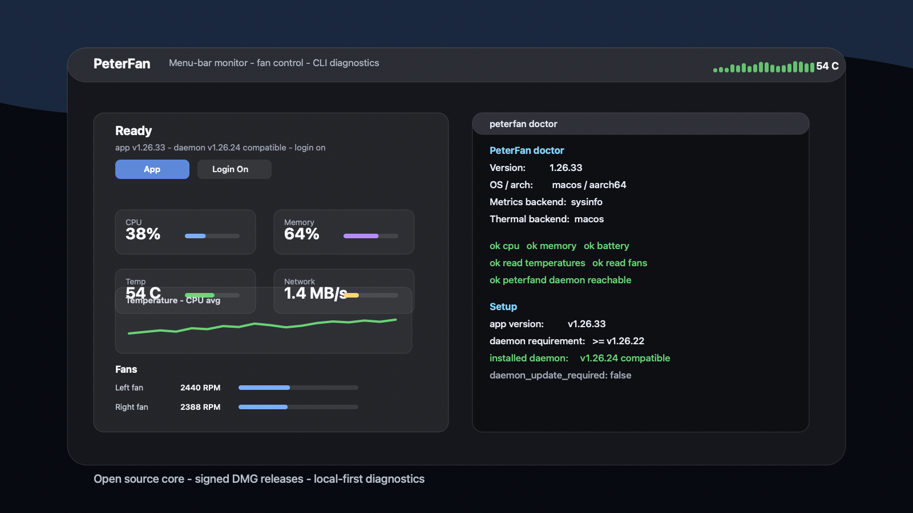
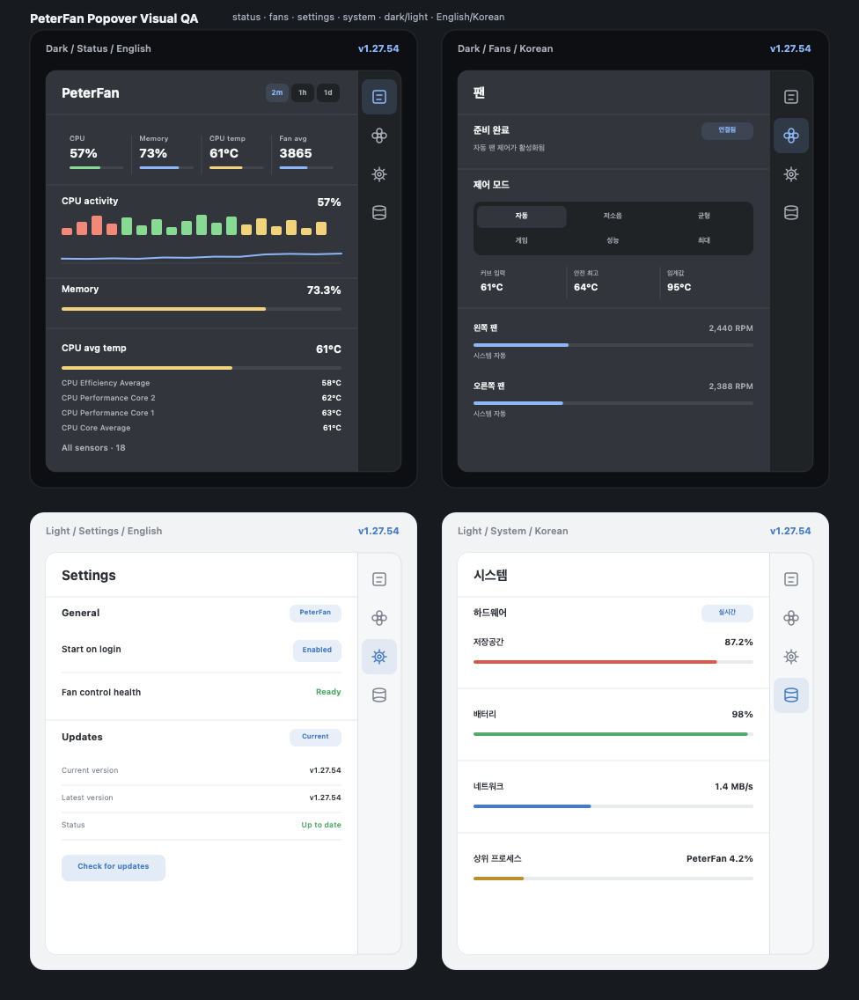

# PeterFan

[English](./README.md) | **한국어** | [日本語](./README.ja.md) | [中文](./README.zh.md)

> **개발자를 위한 Mac 팬 컨트롤러 & 시스템 모니터.** CLI, TUI, macOS 메뉴바 앱을 모두
> 갖춘 크로스플랫폼 팬 컨트롤러이자 하드웨어 모니터 — Rust로 만들었습니다.

[](./LICENSE)
[](https://www.rust-lang.org)






위 QA 이미지는 `scripts/render-popover-qa.swift`로 재생성할 수 있으며, 릴리즈 전에
다크/라이트 모드와 영어/한국어 텍스트가 작은 팝오버 안에서 깨지지 않는지 빠르게
확인하기 위한 리뷰용 스냅샷입니다.

PeterFan은 단순한 팬 속도 슬라이더가 아닙니다. 개발자와 파워유저를 위한 작고 안전하며
스크립트로 다룰 수 있는 시스템 모니터 *겸* 팬 제어 플랫폼입니다 — `lazygit`, `btop`,
`mise` 옆에 나란히 `brew install`해두는 그런 종류의 도구이면서, [iStat
Menus](https://bjango.com/mac/istatmenus/)나 [Stats](https://github.com/exelban/stats)
같은 정신을 이어받은 메뉴바 앱이기도 합니다: CPU 사용량에 맞춰 뛰는 고양이 메뉴바
캐릭터, 지표별 히스토리 차트, 팬 속도 직접 제어, 그리고 `--json`을 Raycast나
대시보드로 파이프하고 싶은 사람들을 위한 스크립트 가능한 CLI/TUI까지 밑단에 갖추고
있습니다.

```text
Tiny · Simple · Beautiful · Safe · Extensible · Cross-platform
```

**PeterFan은 MIT 라이선스의 오픈소스 앱입니다.** 계정 생성, 로그인, 라이선스 입력 없이
다운로드 후 바로 사용할 수 있습니다. 팬 제어는 macOS 보안 정책상 최초 1회 root 헬퍼
설치 승인이 필요하지만, 앱 자체 기능을 쓰기 위한 가입 절차는 없습니다.

---

## Mac용 다운로드 — 터미널 필요 없음

1. **[최신 `.dmg` 다운로드](https://github.com/uulab-official/peterfan/releases/latest)**
   (**Assets** 항목에서 `PeterFan-vX.Y.Z.dmg`를 찾으세요)
2. 더블클릭해서 열고, **PeterFan.app**을 **Applications** 바로가기로 드래그하세요
3. Applications(또는 Spotlight)에서 **PeterFan**을 실행합니다. 공식 `.dmg`는
   Developer ID 서명과 Apple 공증을 거쳐 배포됩니다.

이게 끝입니다 — PeterFan은 이제 조용히 메뉴바에 자리잡습니다. 계정 생성, 로그인,
라이선스 입력은 필요 없습니다. 커맨드라인을 선호하거나 Windows가 필요하다면 아래
[다운로드](#download) 섹션에서 `.tar.gz`/`.zip` 아카이브와 소스 빌드 방법을 확인하세요.

---

## 현재 상태

**베타 — v1.27.54.** 활발히 개발 중이며, 아래 표는 실제로 출시된 기능을 그대로 반영합니다:

| 영역 | 상태 |
| --- | --- |
| **시스템 지표** — CPU, 메모리, 디스크, 네트워크, 프로세스 | ✅ 실측치, `sysinfo` 기반 크로스플랫폼(macOS + Windows) |
| **macOS 메모리 세부 정보** — wired / active / inactive / compressed | ✅ mach `host_statistics64` 기반 실측치 (`vm_stat` 대비 검증 완료) |
| **배터리** — 충전량, 상태, 사이클, 남은 시간, **온도** | ✅ `battery` + IOHID 기반 실측치 (Apple Silicon에서는 health 값 필터링) |
| 코어 모델(타입, 지표, 커브, 프로파일, 트레이트) | ✅ 구현 및 테스트 완료 |
| Mock 백엔드(완전히 시뮬레이션된 머신 + 지표) | ✅ 구현 완료 |
| macOS 하드웨어 정보(`sysctl` 기반 CPU/RAM/OS) | ✅ 실측치, 읽기 전용 |
| **macOS 온도 & 팬 RPM** | ✅ 실측치 — M3 Pro/Max 메뉴바 상단 온도는 CPU core 평균을 기본값으로 사용합니다. `CPU Hottest`는 hot-core SMC 키(`Tf06`/`Tf16`/`Tf26`/`Tf36`/`Tf46`)도 포함해 상세 목록에 표시합니다. 임계 팬 제어는 mapped core 최고를 우선하며, 고정된 진단용 hotspot 값이 팬을 100%로 오작동시키지 않습니다. 각 후보는 별도 행/진단값으로 노출해서 iStat/Macs Fan Control과 비교할 때 어떤 센서 계열이 다른지 바로 확인 가능. 메뉴바 `전체 센서`와 `peterfan temps --all`은 원시 SMC/IOHID 온도 센서를 `CPU hotspot`, `CPU core hot sensor`, `GPU sensor` 같은 일반 그룹명과 함께 표시 |
| Windows 트레이 앱과 시스템 지표 | ✅ CPU, 메모리, 디스크, 네트워크, 프로세스, 배터리 실측 |
| Windows 온도/팬 정보 읽기와 제어(EC/WMI) | 🚧 지원 장치가 없으면 사용 불가로 표시하며 가상값을 사용하지 않음 |
| GPU 사용률 | 🔬 조사 완료 — IOReport 연동 자체는 동작하지만, 노출되는 residency 값이 Activity Monitor의 GPU % 값과 일치하지 않아 부정확한 값을 내보내느니 보류함 ([`docs/RESEARCH.md`](./docs/RESEARCH.md)) |
| 팬 **제어** | ⚙️ SMC 쓰기, **root 권한 필요** (`sudo peterfan fan set N` 또는 데몬 사용). `fan set`은 **RPM을 다시 읽어들여 검증**하므로 가짜 "성공" 메시지가 아니라 진짜 ✓/✗를 확인할 수 있습니다. Intel에서는 검증 완료, Apple Silicon에서는 시도 및 검증되지만(일부 모델은 펌웨어가 이를 무시할 수 있음) |
| CLI — `status`/`cpu`/`memory`/`disk`/`network`/`top`/`battery`/`system`/`temps`/`temps --all`/`fans`/`fan`/`profile`/`curve`/`hardware`/`doctor`/`integrity`/`config`/`serve`/`benchmark`/`log`/`alert`/`completions`, 전역 `--watch` & `--json` | ✅ 실행 가능 — `doctor`는 CPU 대표/최고/summary/aggregate/hotspot/P-core 온도 후보까지 진단, `integrity`는 설치된 앱의 서명/공증/Gatekeeper 상태를 진단 |
| TUI 시스템 대시보드(ratatui) — CPU/메모리/디스크/네트워크/배터리/프로세스 + 온도/팬/전력 | ✅ 실행 가능 |
| **메뉴바 앱** — RunCat처럼 CPU 사용량에 따라 더 빠르게/느리게 뛰는 고양이 메뉴바 캐릭터(숫자/캐릭터/둘 다 선택 가능), 상단 온도는 CPU 평균 기준, 로그인/라이선스 없이 바로 쓰는 간결한 팝오버, Settings의 **시작 시 자동 실행 토글**, 호버 시 간단 요약 툴팁, 2분/1시간/1일 히스토리 차트(호버로 정확한 값 + 평균/피크 확인), **각 팬의 실제 범위에 맞춰진 RPM 슬라이더로 팬별 Auto/Manual 제어**, 프로파일/Auto/Rules 제어, Top Processes에서 프로세스 종료, 영어/한국어 지원, 별도의 크기 조절 가능한 상세 창, 라이트/다크 모드 | ✅ 실행 가능 |
| **데몬**(`peterfand`) — 지속적인 커브 적용 + 종료 시 복원 + 임계 온도 오버라이드 + IPC 서버, LaunchDaemon 설치 지원 | ✅ 실행 가능 |
| **자동 업데이트 & 무결성** — 메뉴바의 "Check for Updates…"(그리고 `peterfan update`)가 GitHub Releases를 확인하고, GitHub asset digest + `checksums.txt` SHA-256 대조 + UULab Developer ID/Bundle ID + code signature + 공증 ticket 검증 후 제자리에서 설치. `peterfan integrity`로 현재 설치된 앱을, `peterfan integrity --latest`/`--tag`로 GitHub 릴리즈 산출물을, `peterfan integrity --dmg ~/Downloads/PeterFan-vX.Y.Z.dmg --checksums ~/Downloads/checksums.txt`로 내려받은 DMG를, `peterfan integrity --release-dir dist/local-release/vX.Y.Z`로 배포 폴더 전체를 같은 기준으로 검증 가능. 릴리즈 폴더 검증은 DMG/tar.gz/checksums/내부 앱 버전이 서로 어긋나면 실패 | ✅ 실행 가능 |
| **로컬 HTTP API**(`peterfan serve`) — 연동을 위한 JSON 지표 제공 및 제어 | ✅ 실행 가능 |
| 데스크톱 GUI(Tauri), 플러그인 | 🗺️ 로드맵 |

아직 실제 센서를 읽을 수 없는 백엔드의 경우, CLI/TUI는 **자동으로 mock 백엔드로
전환되며 해당 데이터에 `simulated`라고 명확히 표시**합니다 — 그래서 항상 동작하는
데모를 볼 수 있고, 실제가 아닌 값을 실제인 척 보여주는 일은 절대 없습니다.

전체 계획은 [`docs/ROADMAP.md`](./docs/ROADMAP.md)를 참고하세요.

---

## 다운로드 (Download)

미리 빌드된 바이너리는 각 [GitHub 릴리즈](https://github.com/uulab-official/peterfan/releases/latest)에
첨부되어 있습니다. macOS(Apple Silicon + Intel, 유니버설) 릴리즈는 로컬 릴리즈
머신에서 Developer ID 서명/공증 후 업로드하며, Windows 빌드는 별도 산출물로 제공됩니다:

| 자산 | 포함 내용 | 이런 분께 적합 |
| --- | --- | --- |
| `PeterFan-vX.Y.Z.dmg` | `PeterFan.app`과 Applications 바로가기만 포함 | 메뉴바 앱만 필요한 분 — 더블클릭, 드래그, 끝 |
| `peterfan-vX.Y.Z-universal-apple-darwin.tar.gz` | `peterfan`(CLI), `peterfan-tui`, `peterfan-menubar`, `peterfand`, **그리고** `PeterFan.app` | 개발자 / 스크립팅 목적 / CLI나 TUI도 함께 쓰고 싶은 분 |
| `peterfan-vX.Y.Z-x86_64-pc-windows-msvc.zip` | `PeterFan.exe`, CLI/TUI, 사용자별 설치·제거 스크립트 | Windows 트레이 앱과 시스템 지표가 필요한 분 |

```sh
# .dmg (메뉴바 앱만, 터미널 불필요)
open PeterFan-*.dmg
# → PeterFan.app을 Applications 바로가기로 드래그한 뒤 평소처럼 실행

# .tar.gz (CLI + TUI + 메뉴바 앱, 개발자용)
tar -xzf peterfan-*-universal-apple-darwin.tar.gz
cd peterfan-*-universal-apple-darwin
open PeterFan.app          # 메뉴바 앱
./peterfan status          # …또는 CLI / TUI를 직접 사용
```

두 형태 모두 같은 방식으로 빌드됩니다 — `.dmg`는 사실 `.tar.gz` 안에 있는 `.app`을
터미널을 쓰고 싶지 않은 사람들을 위해 일반 디스크 이미지로 다시 포장한 것뿐입니다.
Windows는 `.zip`으로 제공됩니다(CLI/TUI/트레이 앱과 사용자별 설치 스크립트 포함).
ZIP을 푼 뒤 PowerShell에서 아래 명령을 실행하면 관리자 승인 없이
`%LOCALAPPDATA%\Programs\PeterFan`에 설치되고 시작 메뉴에 등록됩니다:

```powershell
powershell -ExecutionPolicy Bypass -File .\install.ps1
```

설정 화면의 시작 프로그램 옵션은 현재 사용자 레지스트리만 사용하므로 관리자
암호가 필요 없습니다. Windows ZIP은 GitHub Actions가 테스트, 실측 JSON 스모크
검사, 트레이 단일 실행·재시작 검사, 압축 파일 검증을 마친 뒤 릴리스에 첨부합니다.

공식 `.dmg`는 Developer ID로 서명하고 Apple 공증(notarization)과 stapling까지
마친 뒤 배포합니다. Gatekeeper가 거부한다면 먼저 최신 릴리즈를 다시 받아보고,
문제가 계속되면 `scripts/check-macos-release.sh`로 산출물을 검증하세요. 소스에서
직접 빌드한 개발용 번들은 공증된 공식 릴리즈와 다를 수 있습니다.

메뉴바 아이콘이 보이지만 눌러도 열리지 않는다면 아이콘을 오른쪽 클릭하고
**진단 로그 열기…**를 선택하세요. PeterFan은 시작, 클릭, 팝오버 위치와 WebView
오류를 `~/Library/Logs/PeterFan/menubar.log`에 제한된 크기로 보관합니다.

---

## 팬 제어 활성화(최초 1회)

팬 제어는 SMC에 값을 써야 하므로 **root 권한이 필요**합니다 — Macs Fan Control이나
TG Pro와 정확히 같은 방식입니다. 매번 `sudo`를 입력하는 대신, 작은 root 헬퍼를 한 번만
설치해두세요(macOS 비밀번호 프롬프트가 **딱 한 번** 뜨고, 터미널에서 sudo를 칠 필요는
없습니다):

```sh
./peterfan install-daemon      # GUI 관리자 권한 프롬프트 1회; 매 부팅 시 자동 실행
./peterfan doctor              # root 헬퍼, SMC 키, CPU 온도 후보 진단
```

이후로는 메뉴바의 버튼들과 `peterfan fan …` 명령어가 root 헬퍼를 통해 팬을
제어하며, 추가 프롬프트는 뜨지 않습니다. 최신 헬퍼가 이미 실행 중이면 앱 번들 안의
새 `peterfand`로 팬 제어를 조용히 재설치할 수도 있습니다. 아주 오래된 헬퍼에서
이 기능이 들어간 버전으로 넘어오는 첫 전환만 macOS 승인이 한 번 더 필요할 수
있습니다. 제거하려면 `peterfan uninstall-daemon`을 사용하세요. `peterfan fan set N`은
**RPM을 다시 읽어들여 검증**하므로 실제 ✓/✗ 결과를 확인할 수 있습니다.

---

## 소스에서 빌드하기

[Rust 툴체인](https://rustup.rs)(1.80+)이 필요합니다.

```bash
# 전체 빌드
cargo build

# 현재 머신의 전체 대시보드(실제 CPU/메모리/디스크/네트워크/배터리)
cargo run -p peterfan-cli -- status

# 개별 지표
cargo run -p peterfan-cli -- cpu
cargo run -p peterfan-cli -- top --mem -n 5
cargo run -p peterfan-cli -- network

# 활성화된 백엔드와 그 기능들을 진단
cargo run -p peterfan-cli -- doctor

# 시뮬레이션된 머신 기준으로 전체 실행(데모/CI에 유용)
cargo run -p peterfan-cli -- --mock status

# 실시간 터미널 대시보드
cargo run -p peterfan-tui -- --mock

# macOS 메뉴바(Windows는 시스템 트레이)에서 실시간 지표 보기
cargo run -p peterfan-menubar

# 릴리스 앱 번들을 만들고 포커스를 빼앗지 않게 실행한 뒤 단일 실행 확인
./script/build_and_run.sh --verify
```

설치하고 나면 바이너리 이름은 그냥 `peterfan`입니다.

### 예시: `peterfan status`

```text
PeterFan v1.27.54
backend: sysinfo + macos  ·  Darwin 26.1  ·  up 5d 7h 8m

CPU · Apple M3 Max
   21.6%  ███░░░░░░░░░   cores ▄▃▂▂▂▂▂▂▂ ▁▁ ▁

Memory
  27.4 GB / 36.0 GB ( 76.1%)  █████████░░░
  wired 5.6 GB  ·  active 7.6 GB  ·  compressed 13.4 GB

Disk
  /              896.7 GB / 926.4 GB ( 96.8%)  ████████████  SSD

Network
  en0            ↓    4.2 MB/s  ↑   53.4 KB/s   172.20.248.39  ·  total ↓50.0 GB ↑109.0 GB

Battery
   72.0%  █████████░░░  charging  ~1h 7m to full
  214 cycles  ·  41.8 W

Temperatures
  CPU Core Average  76°C  █████████░░░   (calibrated CPU average)
  CPU Hottest       86°C  ██████████░░
  SSD SSD            36°C  ████░░░░░░░░
  BATT Battery       31°C  ███░░░░░░░░░

Fans
  Fan 1           2445 RPM    3%  ░░░░░░░░░░░░
  Fan 2           2635 RPM    3%  ░░░░░░░░░░░░

Power · 21.2 W
```

어떤 명령어든 `--json`을 붙이면 기계가 읽기 좋은 출력을 얻을 수 있습니다(Raycast,
Stream Deck, Hammerspoon, Home Assistant 등과 연동할 때 유용합니다).

원시 온도 센서를 모두 확인하려면 `peterfan temps --all`을 실행하세요. 기본
`temps`와 메뉴바 상단 온도는 팬 제어와 일상 표시를 위한 보정 대표값만 사용하고,
`--all`은 SMC `T*` 키와 IOHID 센서를 `CPU hotspot`, `CPU core hot sensor`,
`GPU sensor`, `Battery sensor` 같은 일반 이름으로 묶어 보여주며 원래 키와
`source`(`smc`, `iohid`, `battery`)도 비교/진단용으로 함께 남깁니다. 메뉴바의
`전체 센서` 목록도 CPU, GPU, 메모리, 저장장치, 메인보드, 배터리 그룹과 출처
배지로 같은 정보를 보여줍니다.

전체 명령어 레퍼런스는 [`docs/CLI.md`](./docs/CLI.md)를 참고하세요.

---

## 한눈에 보는 아키텍처

```text
   CLI · TUI · GUI · HTTP API        ← presentation, portable
            │
            ▼
        peterfan-core                ← domain types, curves, profiles
            │   (knows nothing about any OS)
            ▼
     HardwareProvider  (trait)       ← the single seam
            ▲
            │ implemented by
   ┌────────┴─────────┬──────────────┐
  mock              macOS          Windows (planned)
                  (sysctl / SMC)   (EC / WMI)
```

코어는 **오직** `HardwareProvider` 트레이트에만 의존합니다. 각 플랫폼은 이 트레이트의
구현체를 하나씩 제공합니다. 나중에 Linux를 지원하려면 백엔드 하나만 추가하면
되고, 코어 코드는 건드릴 필요가 없습니다. 자세한 내용은
[`docs/ARCHITECTURE.md`](./docs/ARCHITECTURE.md)에서 확인하세요.

---

## 프로젝트 구조

```text
peterfan/
├── packages/
│   ├── core/        peterfan-core      — OS-agnostic types, curves, profiles, trait, licensing
│   ├── platform/    peterfan-platform  — mock + macOS backends (Windows/Linux planned)
│   ├── cli/         peterfan           — the command-line interface
│   ├── tui/         peterfan-tui       — ratatui live dashboard
│   ├── menubar/     peterfan-menubar   — macOS menu-bar / Windows tray app
│   └── daemon/      peterfand          — fan-control daemon (curve + safety)
├── tools/
│   └── icongen/          generates the app icon PNG — dev-only, excluded from workspace
├── apps/
│   └── landing/     static marketing website (open apps/landing/index.html)
├── packaging/       LaunchDaemon plist · Homebrew formula · scripts/ install helpers
├── docs/            architecture, roadmap, CLI reference, research notes
└── (planned) apps/desktop (Tauri GUI)
```

---

## 안전성

팬 제어는 하드웨어 수준의 작업이며 부주의하게 다루면 위험할 수 있습니다. PeterFan은
다음 원칙을 지킵니다:

- **역량을 미리 명시** — 각 백엔드는 자신이 무엇을 할 수 있는지 미리 알리며, UI는
  안전하게 수행할 수 없는 제어 기능을 절대 제공하지 않습니다.
- **읽기 전용이 우선** — 모니터링은 권한 상승 없이도 동작하며, 제어는 의도적으로
  분리된 별도의 단계입니다.
- **종료 시 복원** — `peterfand` 데몬은 Ctrl-C / SIGTERM / panic 발생 시 제어권을
  OS에 되돌려주며, 임계 온도를 넘으면 팬을 강제로 100%로 돌립니다.

---

## 기여하기

이제 막 시작한 프로젝트라 참여하기 좋은 시점입니다. [`CONTRIBUTING.md`](./CONTRIBUTING.md)를
참고하세요. 초기 단계에서 가장 가치 있는 기여는 기존 `HardwareProvider` 트레이트
뒤에 붙는 **새로운 플랫폼 백엔드**입니다(macOS의 실제 SMC 읽기, Windows의
EC/WMI 백엔드 등).

---

## 라이선스

이 저장소의 코드는 [MIT](./LICENSE) © PeterFan contributors 라이선스를 따릅니다.
메뉴바 앱, CLI, TUI, 데몬 모두 계정 생성이나 라이선스 입력 없이 사용할 수 있습니다.
